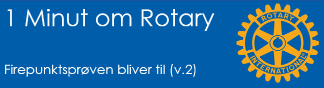
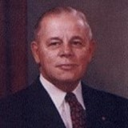
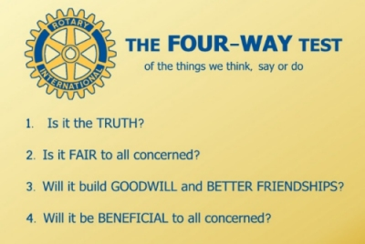

# Firepunktsprøven bliver til

{class="shadow-longer"} 

!!! note "1 minut om Rotary er..."

    Alt om Rotary fortalt i små bidder, der kan læses op på et par minutter ved et Rotarymøde.
    
    Historierne tilstræber at komme hele vejen rundt om Rotary: vores historie, Rotary  basics, organisationen, The Rotary Foundation, Rotarys programmer, partnere og vigtige begivenheder.
    
    Serien er udarbejdet af Uddannelsesudvalget i Rotary Distrikt 1470 i 2020/21
    
    Redaktør: 
    Jens Erik Rasmussen, dg1470-1213@rotary.dk

<a href=https://1minut.rotary.dk/pdf-versioner/1_minut_om_Rotary_Firepunktsproeven.pdf target=_blank>PDF version kan downloades ved at klikke her</a>

Tidligt i 1930’erne var firmaet Club Aluminum Products med 250 ansatte truet af konkurs. Herbert Taylor, der var direktør, rotarianer og en god kristen, måtte handle. Han lagde ud med at se på firmaets adfærd og værdier. Han forklarede senere om planen: 

“Min første opgave var at udstikke nogle retningslinjer, der var så noble som Gud ville ønske at de var i al virksomhed! Hvis vore ansatte kan tænke ret, vil de også handle ret. Vi behøvede en simpel vejledning i den rette adfærd. En slags etisk målestok som vi kunne lære udenad og anvende på hvad vi tænkte, sagde og gjorde.”

Taylor fortsatte: 

”Jeg ledte i mange bøger efter en løsning, men ordene undslap mig. Så gjorde jeg hvad jeg tit gør når jeg står med et problem jeg ikke selv kan løse: Jeg vendte mig mod DEN der har alle svarene. Jeg lænede mig over bordet, hvilede hovedet i hænderne og bad. Efter nogle få øjeblikke så jeg op og nedskrev de ord der kom til mig:

1.	Er det sandt?
2.	Er det rimeligt for alle involverede?
3.	Vil det skabe god vilje og fremme venskab?
4.	Vil det være til gavn for alle involverede?

Jeg kaldte det ”Firepunktsprøven på det vi tænker, siger eller gør.”

Hvad var mere nærliggende end at bruge testen på Club Aluminum selv?? Han indså at firmaets reklametekster rummede meget lidt, der kunne klassificeres som ”sandt”. Han sørgede for en omskrivning så de afspejlede sandheden. Fjendtligheden imod konkurrenterne blev også gransket og justeret.

Efter et par måneder var Herbert klar til at fortælle selskabets fire chefer om testen. Tilfældigvis var de af hver sin religion, men alle fire godkendte prøven og sammen rullede de den ud i hele firmaet. 

I 1932 var firmaet fri af afgrunden. Tyve år senere, på grund af Firepunktsprøven, havde selskabet betalt sin gæld, honoreret ejerne gavmildt og havde sunde finanser.

{class="shadow-longer"} 

Foto af Herbert Taylor, fader til Firepunktsprøven. Senere også Præsident for RI. (Ukendt fotograf)

{class="shadow-longer"} 

Firepunktsprøven på originalsproget. Teksten er aldrig opdateret.

[Læs mere om historien om 4 punkts prøven](https://rotary5630.org/history-of-the-four-way-test/){ .md-button .md-button--primary }

[Læs 4 punkts prøven på Wikipedia](https://en.wikipedia.org/wiki/The_Four-Way_Test){ .md-button .md-button--primary }

Søg og så efter FOUR WAY TEST på Youtube!