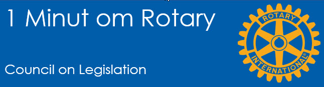

# Council on Legislation

{class="shadow-longer"} 

!!! note "1 minut om Rotary er..."

    Alt om Rotary fortalt i små bidder, der kan læses op på et par minutter ved et Rotarymøde.
    
    Historierne tilstræber at komme hele vejen rundt om Rotary: vores historie, Rotary  basics, organisationen, The Rotary Foundation, Rotarys programmer, partnere og vigtige begivenheder.
    
    Serien er udarbejdet af Uddannelsesudvalget i Rotary Distrikt 1470 i 2020/21
    
    Redaktør: 
    Jens Erik Rasmussen, dg1470-1213@rotary.dk

<a href=https://1minut.rotary.dk/pdf-versioner/1_minut_om_Rotary_Council_on_legislation.pdf target=_blank>PDF version kan downloades ved at klikke her</a>

Enhver forening skal have spilleregler. En forening med mange kulturer, religioner og sprog skal have mange. Et stort bibliotek af love og vedtægter udviklet over mange år skal sikre, at **Rotary er genkendelig** overalt og at medlemmerne har nogenlunde **samme opfattelse af hvad Rotary er**, hvorfor vi er her, vor vision, mission og hvad der kræves for at være medlem.

Rotary har derfor et ”parlament”, kaldet **Council of Legislation (COL)**, hvor alle de cirka 530 distrikter samles hvert tredje år. ”Firmasproget” er amerikansk/engelsk og af hensyn til de ikke engelsktalende lande, bliver møderne simultantolket til hovedsprogene. Hvis der opstår tvivl om tolkningen af en given paragraf, er det dog den engelske udgave der styrer. I Danmark oversætter vi typisk de bestemmelser, der gælder for klubberne, til dansk. 

Således sikrer Rotary sig bedst mu-igt at **alle medlemmer er oplyste, motiverede og står sammen for at nå organisationens mål**. I praksis er Manual of Procedure, ”MOP’en” vores lovbog der benyttes flittigt af guvernørerne, som derfor bør kunne læse og tale engelsk. MOP’en kan af alle medlemmer findes på www.rotary.org. 

Hvis du selv eller en i klubben har en god ide der kan styrke klubbens eller Rotarys evne til at lykkes, kan du stille forslag til enten at ændre en eksisterende lov eller foreslå noget helt nyt.

Vi har i Rotary også en anden mere dynamisk mulighed for at komme til orde, nemlig ved at fremsætte et **resolutionsforslag**. Et eksempel på et sådant er, at Rotary fortsætter med poliokampagnen, til sygdommen er udryddet. Det indebærer, at Rotary end ikke overvejer alternativer, før da. Council On Resolution bliver afviklet elektronisk og hvert år.

Alle distrikter har en COL/COR-repræsentant, som vælges på distriktets årsmøde for en treårig periode. Kandidater skal have været Guvernør og skal efterfølgende tage en COL-teknisk prøve med 80% bestået. 

På de seneste COL, har The Honorable Duane Benton, en amerikansk højesteretsdommer, været formand. Han styrer mødet sammen med en næstformand og støttet af et ekspertpanel. RI’s Generalsekretær (der i øvrigt nu har fået titlen CEO), har ansvaret for implementeringen af de vedtagne forslag, efter COL.

I klubbens dagligdag er reglerne jo sjældent til debat, men når det sker, er det ofte med en henvisning til de **gule sider**. Det skyldes at MOP’en tidligere blev publiceret på gult papir.

[Læs mere om COL på Rotary.org](https://my.rotary.org/en/learning-reference/about-rotary/councils){ .md-button .md-button--primary }