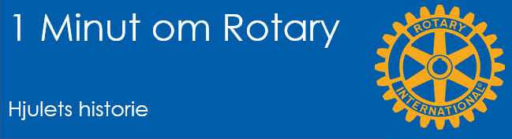
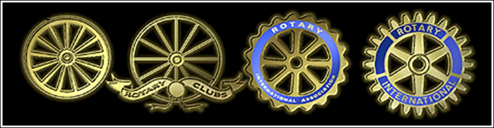

# Hjulets historie

{class="shadow-longer"} 

!!! note "1 minut om Rotary er..."

    Alt om Rotary fortalt i små bidder, der kan læses op på et par minutter ved et Rotarymøde.
    
    Historierne tilstræber at komme hele vejen rundt om Rotary: vores historie, Rotary  basics, organisationen, The Rotary Foundation, Rotarys programmer, partnere og vigtige begivenheder.
    
    Serien er udarbejdet af Uddannelsesudvalget i Rotary Distrikt 1470 i 2020/21
    
    Redaktør: 
    Jens Erik Rasmussen, dg1470-1213@rotary.dk

<a href=https://1minut.rotary.dk/pdf-versioner/1_minut_om_Rotary_Hjulets_historie.pdf target=_blank>PDF version kan downloades ved at klikke her</a>

Hjulet har været et symbol på Rotary siden de tidligste år. Det første design blev lavet i 1905 af Montague Bear der var medlem i Chicago-klubben. Han tegnede et enkelt vognhjul og nogle linjer, der skulle sige ”støv og bevægelse”. Hjulet skulle efter opdraget illustrere ”Civilisation, fremdrift og en samfundsnyttig indsats…”. 

I 1922 blev det besluttet at alle Rotaryklubber skulle enes om et fælles design: Det eksklusive emblem for alle rotarianere. Et tandhjul med 24 tænder og seks eger blev da adopteret af hele organisationen. Tænderne repræsenterer, at der er arbejde at gøre. Egerne den indre retning for vores samfundstjeneste sådan som medlemskabet kommer til udtryk gennem klassifikationsprincippet. Ligeledes repræsenterer egerne også en udadrettet spredning af Rotarys idealer og Firepunktsprøven til samfundet omkring os via de erhverv og poster som medlemmerne beklæder.

En gruppe ingeniører blandt medlemmerne gjorde støj over at dét hjul da ikke ville virke i praksis! Det manglede jo notgang; den lille udfræsning i det inderste hul, der kan overføre kraften fra f.eks. en aksel til hjulet. Den blev så fræset ud i 1923 og designet justeret så illustrationen af at ”..det var en arbejder og ikke en lediggænger der var tale om..” blev tydelig. 
I dag ser man notgangen som billedet på det enkelte medlem, da det er på individplan arbejdet udføres i Rotary. 

Ved Rotary Convention i 1929 blev det besluttet at blå og guld skulle være organisationens officielle farver. Hjulet blev atter opdateret og fik sit nuværende udseende. De fire sektioner i det blå bånd bag tænderne illustrerer de fire tjenestegrene og skønt der i dag er fem af dem, er hjulet ikke blevet opdateret tilsvarende. (Se illustrationen).

En anden udlægning af hjulets symbolik der er i omløb i Rotary er, at de seks eger illustrerer de seks dage om ugen vi kan ”virke” for Rotary og de 24 tænder repræsenterer at vi gør det i alle døgnets timer. Det er dog svært at finde håndfaste beviser for denne udlægning!
Hjulet omtales også som Rotarys ”Mark of Excellence”, hvilket er svært at oversætte, men noget i retning af ”Fortræffelighedsbevis” eller adelsmærke.

{class="shadow-longer"} 