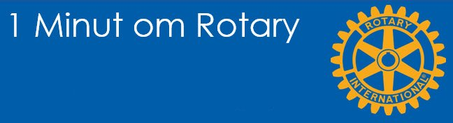

# Indhold

{class="shadow-longer"} 

På denne side kan du se en oversigt over de 1-minuts historier, der er udviklet.

Klik på den relevante historie for at få denne vist.

- [1 minut om Rotary - vision og mission](visionmission.md)
- [1 minut om Rotary - de regionale magasiner](magasiner.md)
- [1 minut om Rotary - Council on legislation](col.md)
- [1 minut om Rotary - Rotary adopterer 4-punkts prøven](4punkt.md)
- [1 minut om Rotary - hjulets historie](hjuletshistorie.md)
- [1 minut om Rotary - kvinder i Rotary](kvinderirotary.md)
- [1 minut om Rotary - møderet for hele verden](moederet.md)
- [1 minut om Rotary - Rotary meget kort](rotarykort.md)
- [1 minut om Rotary - Rotary og FN](rotaryogfn.md)
- [1 minut om Rotary - Rotary Paul Harrins](paulharris.md)
- [1 minut om Rotary - Rotary skabes](rotaryskabes.md)
- [1 minut om Rotary - Rotarys fem tjenestegrene](tjenestegrene.md)
- 1 minut om Rotary - Rotarys første år
- 1 minut om Rotary - Rotationsprincippet
- 1 minut om Rotary - Strategiske prioriteringer
- 1 minut om Rotary - Ungdomsudveksling
