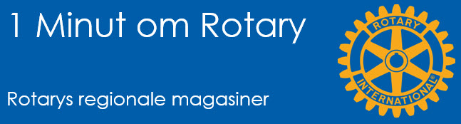
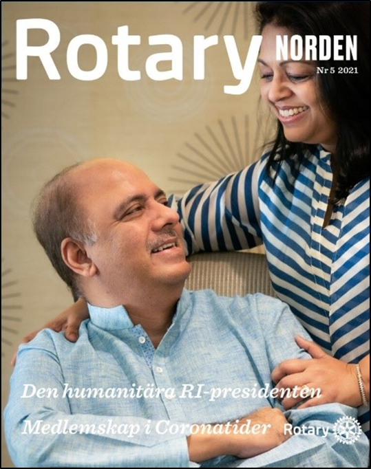

# De regionale magasiner

{class="shadow-longer"} 

!!! note "1 minut om Rotary er..."

    Alt om Rotary fortalt i små bidder, der kan læses op på et par mi-nutter ved et Rotary-møde.
    
    Historierne tilstræber at komme hele vejen rundt om Rotary: vores historie, Rotary  basics, organisa¬ti¬o¬nen, The Rotary Foundation, Rotarys programmer, partnere og vigtige begivenheder.
    
    Serien er udarbejdet af Uddannelsesudvalget i Rotary Distrikt 1470 i 2020/21
    
    Redaktør: 
    Jens Erik Rasmussen, dg1470-1213@rotary.dk
    Med ekspertbistand fra Jens Otto Kjær Hansen, Dansk redaktør for Rotary Norden

<a href=https://1minut.rotary.dk/pdf-versioner/1_minut_om_Rotary_De_regionale_magasiner.pdf target=_blank>PDF version kan downloades ved at klikke her</a>

Alle medlemmer af Rotary skal ifølge Rotarys grundlov abonnere på et Rotary-magasin så længe medlemskabet består. På den måde informeres vi om hvad Rotary sysler med. Ifølge samme lov beslutter hver klub hvilket magasin medlemmerne skal modtage og sørger for at betale afgiften til det valgte magasin for medlemmerne. Danmark har valgt **Rotary Norden** til magasin.

Magasinernes opgave er at om-tale Rotarys aktiviteter i det område hvor de udkommer og bringe ”pligtstof” fra det officielle Rotary Magazine og Rotary i øvrigt. Således fører RI tilsyn med magasinernes indhold og pris. Visse af de regionale magasiner udgives af kommercielle selskaber med ansatte medarbejdere. Nogle – heriblandt Rotary Norden – drives af rotarianere i samarbejde med professionelle leverandører. 

Knap halvdelen af Rotarys medlemmer modtager Rotary Magazine, der udgives på engelsk af RI. Magasinet er not-for-profit og et eventuelt overskud på driften, skal komme Rotarys aktiviteter til gavn. De resterende cirka 770.000 medlemmer abonnerer på et af de (i 2021) 33 regionale magasiner som udgives verden over, på licens fra RI og på 21 sprog. Det er altså langt fra alle medlemmer der som vi modtager det obliga¬toriske blad på deres eget sprog.

De fem nordiske landes distrikter har siden 1936 i et fælles selskab udgivet Rotary Norden og alle klubber i Norden har tilsluttet sig. Det er det eneste regionale ma-gasin der udkommer på fire samtidige sprog. Et andet udkommer på tre og syv magasiner på to sprog. I kraft af det nordiske samarbejde er Rotary Norden med et oplag på 55.000 både Europas næststørste magasin og det næst-billigste, med en medlemspris på Kr. 61 for fem årlige udgivelser.

Klubber og distrikter verden over arbejder for at det skal være slut med at tvinge medlemmer til at abonnere på et Rotary-magasin. Senest blev der ved COL (Council on Legislation) i 2019 fremsat hele to forslag om enten at fjerne alle referencer til et magasin fra vedtægterne eller at gøre det frivilligt. Begge forslag blev nedstemt med overvældende majoritet. 

Rotarymagasinerne er dog blevet pålagt at udkomme i både trykt og digital form og give valgfrihed imellem de to. I Danmark kan vi via rotary.dk vælge om vi vil modtage Rotary Norden i papirform eller digitalt.

{class="shadow-longer"} 

