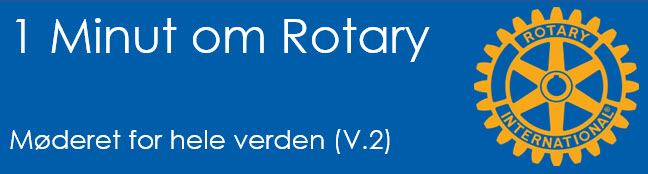
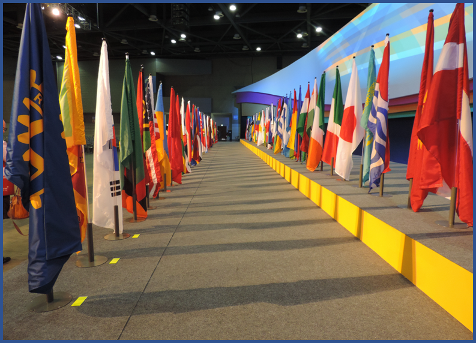

# Møderet for hele verden

{class="shadow-longer"} 

!!! note "1 minut om Rotary er..."

    Alt om Rotary fortalt i små bidder, der kan læses op på et par mi-nutter ved et Rotary-møde.
    
    Historierne tilstræber at komme hele vejen rundt om Rotary: vores historie, Rotary  basics, organisa¬ti¬o¬nen, The Rotary Foundation, Rotarys programmer, partnere og vigtige begivenheder.
    
    Serien er udarbejdet af Uddannelsesudvalget i Rotary Distrikt 1470 i 2020/21
    
    Redaktør: 
    Jens Erik Rasmussen, dg1470-1213@rotary.dk

<a href=https://1minut.rotary.dk/pdf-versioner/1_minut_om_Rotary_Møderet_for_hele_verden.pdf target=_blank>PDF version kan downloades ved at klikke her</a>

Siden starten i Chicago, USA i 1905 er Rotary vokset til en af verdens største humanitære organisationer eller såkaldte Serviceklubber. Derefter – både i tid og størrelse - kommer en række lig¬nende organisationer, hvoraf Lions nok er den mest kendte i Danmark.

Rotary har i dag klubber i næsten alle verdens lande og mere end 200 geografiske områder. Ved Rotary Convention, den årlige ”generalforsamling”, er der tradition for at flagene fra alle medlemslandene bringes ind på scenen, ét af gangen. Det er et imponerende skue i fest og farver og tekstiler man næppe kommer til at se igen med mindre man deltager på en Convention mere.

Der er fortsat lande der ikke tillader Rotary at etablere klubber og andre der lægger restriktioner på Rotarys arbejde. Nordkorea, Vietnam, Iran, nogle af Emiraterne, Libyen, Somalia, og Cuba har pt. ikke Rotaryklubber. Kina åbnede i 2006, delvis pga. en særlig indsats fra Danmarks davæ¬rende Ambassadør i Kina Christopher Bo Bramsen (27/4 1943- 3/11 2011, medlem af København Rotary Klub). Kort inden Rotary Convention i København kunne det hjulprydede flag placeres i Beijing, hvor klubber dog kun tillades at optage derboende udlændinge. 

Rotary har desuden præsteret at blive smidt ud af lande hvorefter de har fået mulig¬hed for at komme tilbage. I Tyskland under 2. Verdenskrig gjorde nazisterne Rotary livet svært og efter krigen ønskede Rusland ikke Rotary i Østeuropa. Heldigvis er Rotary nu igen veletableret dér; også i Rusland om end med relativt få klubber og visse van¬ske¬ligheder med at operere frit. 

Hvorfor har det betydning for Rotarys medlemmer? Jo, vort medlemsbevis Rotaryhjulet åbner døren til alle de cirka 35.000 klubber som findes spredt ud over kloden. På ferier og på forretningsrejser kan man få en stor oplevelse ved at lægge vejen forbi den lokale Rotary-klub. Det kræver kun at man finder ud af hvor den holder til: Brug ”Club Finder” på www.rotary.org eller APP’en ”Rotary Club Locator”, send en e-mail eller ring til dem. 

Jo fjernere himmelstrøg, jo større oplevelser venter der oftest, men selv naboklubben kan have helt andre traditioner end ens egen klub.

{class="shadow-longer"} 
Et udsnit af flagalleen ved Rotary Convention i Seoul i 2016. Længst til venstre Rotarys flag, derefter verdenspræsidentens og derefter værtslandets flag.