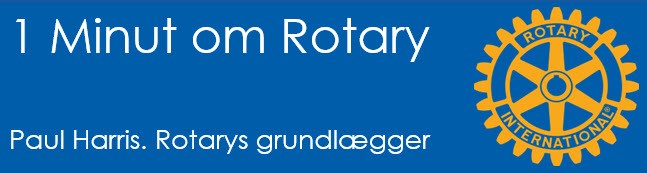
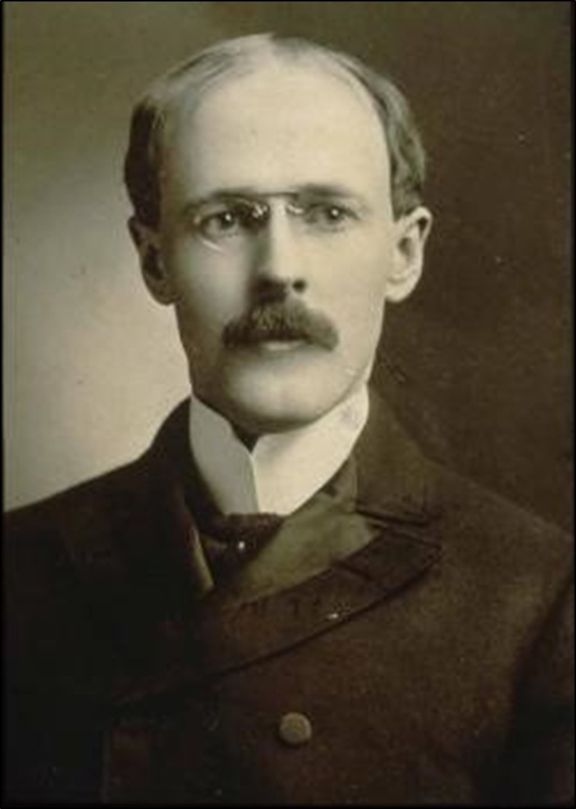

# Paul Harris - Rotarys grundlægger

{class="shadow-longer"} 

!!! note "1 minut om Rotary er..."

    Alt om Rotary fortalt i små bidder, der kan læses op på et par mi-nutter ved et Rotary-møde.
    
    Historierne tilstræber at komme hele vejen rundt om Rotary: vores historie, Rotary  basics, organisa¬ti¬o¬nen, The Rotary Foundation, Rotarys programmer, partnere og vigtige begivenheder.
    
    Serien er udarbejdet af Uddannelsesudvalget i Rotary Distrikt 1470 i 2020/21
    
    Redaktør: 
    Jens Erik Rasmussen, dg1470-1213@rotary.dk

<a href=https://1minut.rotary.dk/pdf-versioner/1_minut_om_Rotary_Rotary_Paul_Harris.pdf target=_blank>PDF version kan downloades ved at klikke her</a>

Paul blev født 19. april 1868 i Wisconsin, USA. Tre år gammel flyttede han til sine farforældre i Vermont, hvor han voksede op. Fordi familien var spredt for alle vinde, blev de venskaber Paul havde igennem barndommen særligt vigtige for ham. 

Han var alt andet end en læsehest og blev bortvist fra flere skoler. Han brugte hellere tiden på at klatre i bjerge, fiske og gå på opdagelse.

Efter gymnasiet 20 år gammel blev han piccolo i et mineselskab i Vermont hvor hans storebror var sælger. Hans ansvar var at møde før alle andre, tænde op og gøre kontoret klar til medarbejderne der kom senere. Han bestod op-gaven trods sin natur og bestem¬te sig for at læse jura, usikker på, om han havde rygrad til at gennemføre.

På vejen til Vermont gjorde han stop i Chicago hvor en studiekammerat nu var reporter på en lokal avis. Han kunne vise Chicagos alle sider frem for Paul, der blev lige imponeret og frastødt af byens puls, sociale spændinger og røverhistorier.

Han fuldførte dog jurastudiet ved Universitet i Iowa i 1891, som 23-årig. Han ræssonerede senere, at han som menneske havde fået mere ud af samværet med sine medstuderende, end af selve studierne.

Efter jurastudiet blev Paul grebet af udlængsel. Han dedikerede de næste fem år til at rejse rundt på må og få og samle på venskaber og oplevelser. Han besluttede også, at når de fem år var gået, ville han nedsætte sig som advokat i Chicago!

Hans fem år på valsen bragte ham til flere amerikanske byer hvor han tog alle mulige fore-faldende jobs, fra appelsinplukker i Florida til sælger, men rejste også over Atlanterhavet til England som kvægdriver på en båd.

I 1896 landede han i Chicago og gjorde alvor af sine planer.

{class="shadow-longer"} 
Paul Harris, Rotarys grundlægger (Ukendt fotograf)