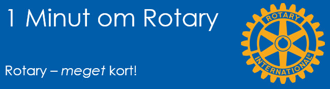

# Rotary meget kort

{class="shadow-longer"} 

!!! note "1 minut om Rotary er..."

    Alt om Rotary fortalt i små bidder, der kan læses op på et par mi-nutter ved et Rotary-møde.
    
    Historierne tilstræber at komme hele vejen rundt om Rotary: vores historie, Rotary  basics, organisa¬ti¬o¬nen, The Rotary Foundation, Rotarys programmer, partnere og vigtige begivenheder.
    
    Serien er udarbejdet af Uddannelsesudvalget i Rotary Distrikt 1470 i 2020/21
    
    Redaktør: 
    Jens Erik Rasmussen, dg1470-1213@rotary.dk

<a href=https://1minut.rotary.dk/pdf-versioner/1_minut_om_Rotary_Rotary_meget_kort.pdf target=_blank>PDF version kan downloades ved at klikke her</a>

Rotary er et ægte globalt netværk der har mere end en million medlemmer spredt i ca. 35.000 lokale grupper, kaldet klubber, i hele verden. Medlemmerne bruger tid og ressourcer på at takle verdens mest presserende humanitære problemer. 

I Danmark er ca. 10.000 medlem-mer fordelt ud over alle landsdele inklusive Færøerne og Grønland.  Medlemskabet giver adgang til et værdifuldt socialt fælles¬skab og personlig udvikling. 

People of action. Rotary viser samfundssind og går forrest, når og hvor det er nødvendigt. Med brede og dybe personlige og professionelle kompetencer, der er i stand til at få ideer, forretning og velgørenhed til at gå op i en højere enhed. 

Som medlem af Rotary har man fri adgang til alle klubber i verden, hvilket betyder at man har mulig-hed for at træde direkte ind i et lokalt miljø med gode og solide kontak¬ter, hvor som helst på kloden. 

Stor og kompleks. Rotary er svær at forstå hurtigt. Essensen af organisationens virke formuleres således: 

Join leaders, 
exchange ideas,
take action

Noget i retning af ”Mød andre ildsjæle, udveksl ideer med dem og få noget til at ske”.

Service above self er Rotarys motto. I fællesskab udfører vi opgaver, der er større end os selv, på alle planer lige fra julehjælp til trængende familier, sansehaver til ældre og syge, overlevelsesudstyr til naturkatastrofer og i klodens brændpunkter samt store kampagner som f.eks. End polio now.

End polio now er bevis på ved-holdenhed og stærkt internationalt samarbejde. Rotary har siden 1988 gået forrest i kampen mod polio (på dansk: børnelammelse). Det er en potentielt dødelig, men altid invaliderende sygdom, med slemme senfølger. Sammen med WHO, CDC og Bill & Melinda Gates Foundation rejser vi kapital og yder frivillige timer til at gennemføre vaccinationskampagner.

Fred gennem uddannelse. I Rotary tror vi på, at når forskel-lige nationaliteter sættes sam-men for at studere eller blot lære hinanden at kende, giver det en bedre forståelse og større accept af forskellighed. Rotary er en af verdens største donorer af studielegater og kulturudveksling, specielt for børn og unge. Rotarys udvekslingsprogrammer dækker områder fra kulturudveksling over ferielejre, til  legater til college og det flotte Rotary Peace Fellow-program der giver kandidaterne en uddannelse på Masterniveau på et af fem universiteter i verden.