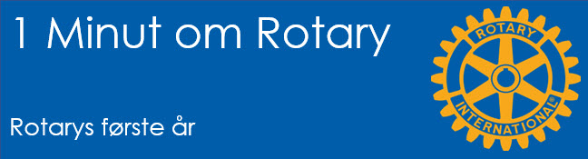

# Rotarys første år

{class="shadow-longer"} 

!!! note "1 minut om Rotary er..."

    Alt om Rotary fortalt i små bidder, der kan læses op på et par mi-nutter ved et Rotary-møde.
    
    Historierne tilstræber at komme hele vejen rundt om Rotary: vores historie, Rotary  basics, organisa¬ti¬o¬nen, The Rotary Foundation, Rotarys programmer, partnere og vigtige begivenheder.
    
    Serien er udarbejdet af Uddannelsesudvalget i Rotary Distrikt 1470 i 2020/21
    
    Redaktør: 
    Jens Erik Rasmussen, dg1470-1213@rotary.dk

<a href=https://1minut.rotary.dk/pdf-versioner/1_minut_om_Rotary_Rotarys_første_aar.pdf target=_blank>PDF version kan downloades ved at klikke her</a>

Medlemstallet steg og Paul blev efterhånden overbevist om at ideen var rigtig. De fleste var mænd fra oplandet som forventede at medlemskabet gav dem forretninger. 

Først i 1907 blev Paul selv klubbens præsident. Han havde tre mål: At føre klubben videre, At etablere Rotary i andre byer og at lægge <strong>community service</strong> til klubbens program. I løbet af 1910 var der 14 klubber i USA. Da blev det besluttet etablere en organisation, der dels kunne sikre Rotarys ekspansion, dels formidle gode ideer og kontakt imellem klubberne. Organisationen fik – ret kækt - navnet <strong>The International Association of Rotary Clubs</strong>. De var jo endnu kun i USA!

Klubberne vedtog regler der bød dem at deltage i en <strong>Convention</strong>. Den første fandt sted i 1910 i Chicago hvor Paul valgtes til organisationens første præsident og med ham en bestyrelse på ni mand fra lige så mange klubber. 

Genvalgt i 1911 fortsatte Paul ekspansionen og formede programmet. Sliddet havde tæret på helbredet og da året var omme trak Paul sig tilbage til New England for at slappe af. Det skabte usikkerhed om han var ved at opgive sit projekt og skabe en personkult i stedet. Han fulgte med på afstand og styrede retningen ved belærende, men ikke moraliserende artikler. Han kom sig dog efterhånden, stiftede familie og fortsatte utrætteligt arbejdet.

Rotary var det første kendte forsøg på at forene akademikere og handlende om et fælles mål. Som advokat brændte Paul for at bygge bro over dette skel og de første medlemmer var kulhandleren, skrædderen, ingeniøren og advokaten. Klassifikations¬princippet var grund¬lagt! 

I starten anså man det for vigtigt at medlemmerne handlede indbyrdes. Chicago-klubben havde som et af dens formål: The promotion of the business interests of its members! En <strong>Klubstatistiker</strong> skulle ved hvert møde fremlægge statistik for den indbyrdes handel. 

Denne form for <strong>vocational service</strong> blev dog opgivet fordi den mindede om selviskhed og var langt fra Pauls ideer om både at bygge bro og yde uselviske tjenester til andre. Det som senere blev fastslået i sloganet ”Service above self” som dog først blev godkendt som Rotarys officielle slogan i 1950 efter at have været i brug i 30-40 år.

{class="shadow-longer"} 
Udviklingen i Rotarys medlemsbevis: Rotaryhjulet