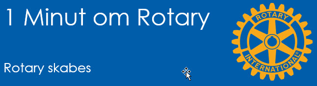
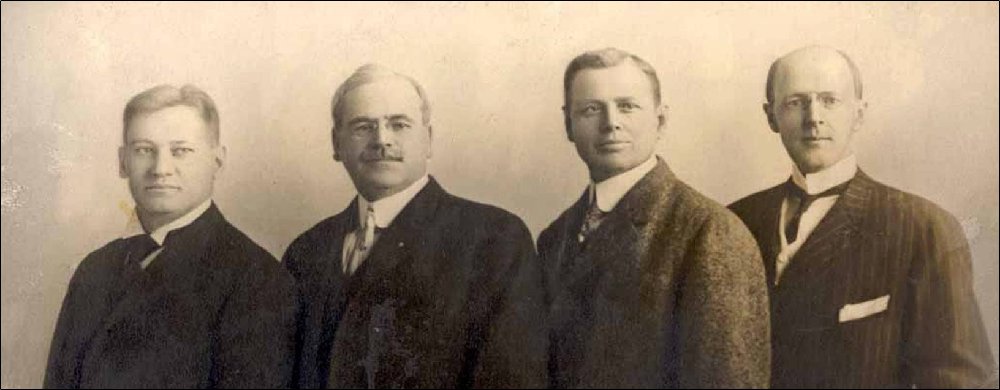

# Rotary skabes

{class="shadow-longer"} 

!!! note "1 minut om Rotary er..."

    Alt om Rotary fortalt i små bidder, der kan læses op på et par minutter ved et Rotarymøde.
    
    Historierne tilstræber at komme hele vejen rundt om Rotary: vores historie, Rotary  basics, organisationen, The Rotary Foundation, Rotarys programmer, partnere og vigtige begivenheder.
    
    Serien er udarbejdet af Uddannelsesudvalget i Rotary Distrikt 1470 i 2020/21
    
    Redaktør: 
    Jens Erik Rasmussen, dg1470-1213@rotary.dk

<a href=https://1minut.rotary.dk/pdf-versioner/1_minut_om_Rotary_Rotary_skabes.pdf target=_blank>PDF version kan downloades ved at klikke her</a>

I 1896 bosatte Paul Harris sig i Chicago for at starte advokatpraksis. Da havde han været ”på valsen” i USA og Europa i fem år. År hvor han havde samlet på oplevelser og bekendtskaber og gjort sig erfaringer om livets vilkår for både rig og fattig. 

De første år var både ensomme og slidsomme. Der var opgaver nok, men der var også stor konkurrence. En dag i år 1900 skulle Paul mødes med en advokatkollega fra den nordlige del af byen. De gik en tur i kvarteret for at ”sætte maden” og Paul oplevede en kollega der var på fornavn med de forretningsdriven¬de langs ruten og fik sig en sludder med mange af dem. Han havde ikke oplevet den form for venskaber siden han kom til byen!

Det fik ham til at tænke over om ikke tusinder af andre tilflyttere var i samme situation som han; kom-met ind ”med 4-toget” uden at kende en mors sjæl. Var der mon en måde hvorpå man kunne bringe alle disse ensomme tilflyttere sammen?  Hans klientel var da godt, men hverken bekendte eller venner - endnu.

Han fik overtalt tre forretningsforbindelser til at mødes for at diskutere sagen. En aften i februar 1905 mødtes de fire: Advokat Paul Harris, kulhandler Silvester Schiele, skrædder Hiram Shorey og ingeniør Gustavus ”Gus” Loehr på dennes kontor i centrum af Chicago til det der senere blev kendt som det første Rotarymøde og datoen: 23. februar som Rotarys fødselsdag. 

Gruppen, der snart begyndte at vokse, mødtes hver uge og de første møder gik med at tale om hvad man skulle lave og hvad denne nye gruppe skulle kaldes. Paul kom med flest forslag og Rotary var et af dem. Det fangede an med det samme og repræsenterede Pauls tanker om at både mødested og formandskab, ja endda selve medlemskabet, skulle rotere. Det sidste fordi man derved sikrede en høj mødeprocent. 

Udeblivelse blev straffet med en bøde på 50 cent og indtægten kunne i starten dække alle klubbens driftsomkostninger!

{class="shadow-longer"} 
De fire første Rotarianere: Gus, Silvester, Hiram og Paul