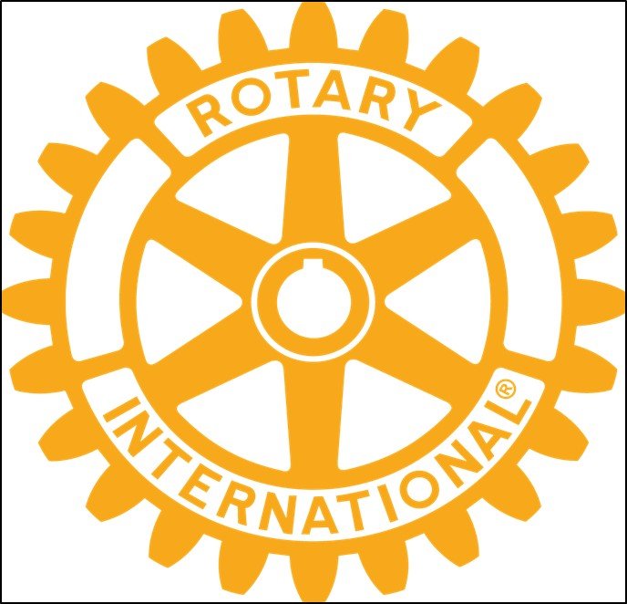

# Rotationsprincippet

{class="shadow-longer"} 

!!! note "1 minut om Rotary er..."

    Alt om Rotary fortalt i små bidder, der kan læses op på et par mi-nutter ved et Rotary-møde.
    
    Historierne tilstræber at komme hele vejen rundt om Rotary: vores historie, Rotary  basics, organisa¬ti¬o¬nen, The Rotary Foundation, Rotarys programmer, partnere og vigtige begivenheder.
    
    Serien er udarbejdet af Uddannelsesudvalget i Rotary Distrikt 1470 i 2020/21
    
    Redaktør: 
    Jens Erik Rasmussen, dg1470-1213@rotary.dk

<a href=https://1minut.rotary.dk/pdf-versioner/1_minut_om_Rotary_Rotationsprincippet.pdf target=_blank>PDF version kan downloades ved at klikke her</a>

Distriktsguvernørens årlige besøg i klubben er for mange den tydeligste markering af Rotarys såkaldte rotationsprincip: at visse poster i organisationen besættes for ét år af gangen uden mulighed for genvalg. 

Princippet er ikke omtalt i love og regler, men efterleves via fastlagte valgperioder og tradition. I de tidlige år gjaldt rotationen meget mere end lederposterne; for eksempel skulle også medlemskabet fornys hvert år. Mødestedet roterede ugentligt rundt mellem medlemmerne hvilket gav organisationen dens navn Rotary. 

I mange år roterede alle hverv, men det var kun et krav for de poster hvis valgperiode er indskrevet i love og vedtægter, bl.a. præsidenter, guvernører og bestyrelsesmedlemmer i RI, der dog udpeges for to år. Andre poster kunne besættes for flere år.

I de senere år har Rotary indset at vi mister for meget fremdrift og kontinuitet ved den massive udskiftning af ledere. Nu fastholdes det at Præsidenten for Rotary International, distriktsguvernørernes og klubpræsidenters valgperiode er ét år. Man lægger mere vægt på succession og kontinuitet sådan at alle andre poster anbefales besat for 3-5 år af gangen, afhængig af hvilken post der er tale om.

Selv om det både er dyrt og besværligt at holde rotationen i live, holder Rotary fast ved det fordi der er en masse fordele:

- Det udvikler det enkelte medlem fordi man får mulighed for at afprøve en masse forskellige arbejdsopgaver i klubber og udvalg på alle planer
- Det udvikler ledere. I distriktsledelsen sidder typisk netop afgåede, siddende, kommende og næst kom-mende guvernør. Med ca. 530 distrikter giver det godt 2.000 guvernører til enhver tid og dertil en masse pos¬ter i komiteer, råd og ud¬valg, hvoraf mange skal have været guvernør
- -Det sikrer retræten. De fleste kan påtage sig en lederpost når de ved den kun tager et år at udføre

{class="shadow-longer"} 
Rotary-hjulet bidrager via sin form med 24 tænder og seks eger til at illustrere rotationsprincippet. Der er skrevet en særskilt 1-minut-om-Rotary-historie om hjulets betydning og symbolik.