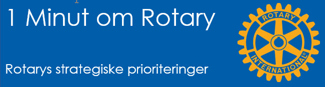

# Rotarys strategiske principper

{class="shadow-longer"} 

!!! note "1 minut om Rotary er..."

    Alt om Rotary fortalt i små bidder, der kan læses op på et par mi-nutter ved et Rotary-møde.
    
    Historierne tilstræber at komme hele vejen rundt om Rotary: vores historie, Rotary  basics, organisa¬ti¬o¬nen, The Rotary Foundation, Rotarys programmer, partnere og vigtige begivenheder.
    
    Serien er udarbejdet af Uddannelsesudvalget i Rotary Distrikt 1470 i 2020/21
    
    Redaktør: 
    Jens Erik Rasmussen, dg1470-1213@rotary.dk

<a href=https://1minut.rotary.dk/pdf-versioner/1_minut_om_Rotary_Strategiske_Prioriteringer.pdf target=_blank>PDF version kan downloades ved at klikke her</a>

For at kunne realisere visionen for Rotary og Rotary Foundation har bestyrelsen udpeget fire indsatsområder for vort arbejde frem mod 2025. Rotary skal: 

<strong>Øge sin påvirkning på verden</strong>
Rotary stræber efter at forbedre menneskers livskvalitet. Frivillige investerer deres tid og ressourcer i en bred palet af indsatser, men Rotary skal være bedre til at måle effekten af denne indsats. Vores evne til at tiltrække medlemmer, partnere og donorer forbedres hvis vi kan dokumentere varige resultater af vores indsatser.

Målene er at:
- Udrydde polio og få anerkendelse for det
- Fokusere vore pro¬gram¬mer og tilbud endnu mere
- Forbedre vores evne til at gøre en forskel og måle på den

<strong>Nå ud til nye målgrupper</strong>
Mange mennesker søger veje til at kunne gøre forskel i verden, sammen med andre. Hvordan hjælper vi de mennesker med at finde det de søger i Rotary? 
Det gør vi ved at skabe enestående muligheder for at endnu flere mennesker og organisationer kan deltage i arbejdet. 

Klubberne vil altid være vigtige, men for at kunne nå nye målgrupper vil vi forny og udvide vore tilbud med anderledes måder at mødes og være sammen på i et meningsfuldt og målrettet fællesskab. 

Målene er at:

- Få flere medlemmer og flere muligheder for at engagere sig
- Skabe nye fødekæder til Rotary
- Øge Rotarys åbenhed og appel
- Skabe fokus på vort arbejde og image

<strong>Øge medlemmers engagement</strong>
I anerkendelse af de udfor¬drin-ger klubberne står overfor i dag, vil Rotary støtte dem i at kunne levere en kluboplevelse som får medlemmerne til at blive, og engagere sig mere. Når klubber fokuserer på den gode kluboplevelse, bliver medlemmerne mere tilbøjelige til at engagere sig i og for fællesskabet. 

Målene er at:

- Hjælpe klubberne med at engagere medlemmerne
- Rette fokus på kluboplevelsen
- Tilbyde nye muligheder for personlig og professionel udvikling
- Tilbyde relevant leder¬ud¬dan-nelse og færdighedstræning

<strong>Forbedre vores tilpasningsevne</strong>
For at være på omgangshøjde med de globale tendenser skal vi løbende justere på både struktur og kultur. Vi må sikre at vore styrende organer og drift er effektive, fleksible og inddrager alle målgrupperne. 

Målene er at:

- Bygge en nysgerrig, risikovillig og innovativ kultur på alle planer
- Strømline styringen af organisationen og sikre mangfoldighed i ledelsen