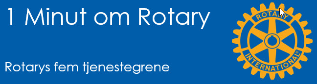

# Rotarys fem tjenestegrene

{class="shadow-longer"} 

!!! note "1 minut om Rotary er..."

    Alt om Rotary fortalt i små bidder, der kan læses op på et par mi-nutter ved et Rotary-møde.
    
    Historierne tilstræber at komme hele vejen rundt om Rotary: vores historie, Rotary  basics, organisa¬ti¬o¬nen, The Rotary Foundation, Rotarys programmer, partnere og vigtige begivenheder.
    
    Serien er udarbejdet af Uddannelsesudvalget i Rotary Distrikt 1470 i 2020/21
    
    Redaktør: 
    Jens Erik Rasmussen, dg1470-1213@rotary.dk

<a href=https://1minut.rotary.dk/pdf-versioner/1_minut_om_Rotary_Rotarys_fem_tjenestegrene.pdf target=_blank>PDF version kan downloades ved at klikke her</a>

På dansk leder ordet <strong>service</strong> tanken hen på noget som bilen og computeren skal have en gang imellem. Det gælder for så vidt også på engelsk, men dér har ordet langt flere og dybere betydninger; eksempelvis <strong>værnepligt</strong> og <strong>tjeneste</strong> - af den type man kan gøre hinanden.

Et sted midt imellem disse to betydninger er begrebet <strong>serviceklub</strong> opstået, der i den engelsksprogede verden bruges om organisationer som Rotary. Organisationer der er skabt til at yde samfundet tje¬nester – service, på ba¬sis af medlemmernes eget engagement og interesser.

Rotarys tjenester skal leveres inden for fem <strong>indsatsområder</strong>, som Rotarys skabere kaldte Avenues of Service, hvilket så på dansk er blevet til tjenestegrene.

<strong>De fem områder er:</strong>

<strong>Klubtjenesten</strong>, som dækker den indsats vi som medlemmer yder til vores klub for at den skal fungere ordentligt. 

<strong>Erhvervstjenesten</strong> (I begyndelsen kaldet Kalds- og virketjenesten) har til formål at fremme høje etiske standarder i medlemmets private og professionelle liv, aner-kendelsen af værdien af enhver respektabel profession og fremmelse af lysten til at tjene hos den enkelte. Medlemmernes rolle er at lede sig selv og sine virksomheder i overensstemmelse med Rotarys principper og tilbyde sine færdigheder til de projekter klubben gennemfører til samfundets gavn. 

<strong>Samfundstjeneste</strong> omfatter de indsatser af varierende karakter medlemmerne yder, alene eller i fællesskab, til gavn for livs¬kva-liteten hos de der lever inden for klubbens område.

<strong>International tjeneste</strong> omfatter de indsatser medlemmerne gør for at fremme international for-ståelse, velvilje og fred gennem mødet med mennesker fra an-dre lande, kulturer og skikke, som de kan tilvejebringes gen-nem klubbens aktiviteter i og med andre lande.

<strong>Ungdomstjenesten</strong>, den eneste tjeneste der er kommet til sene¬re (2010), anerkender ungdom-mens positive indflydelse på omgivelserne, der muliggøres gennem lederskabstræning, involvering i samfundstjeneste og internationale opgaver samt udvekslingsprogrammer der medvirker til skabelse af in¬ter-national forståelse og fred.

!!! tip "Vidste du at..."

    
Ud over Rotarys hovedmotto 
    <strong>Service Above Self</strong>
    har Rotary også mottoet 
    One profits most who serves best
    der tydeligt illustrerer hvorfor det er vigtigt for alle at være tjenstvillig og vise samfundssind.

