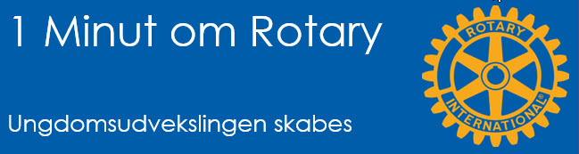
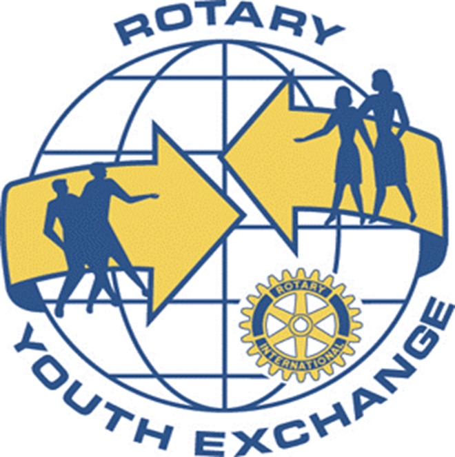

# Ungdomsudvekslingen skabes

{class="shadow-longer"} 

!!! note "1 minut om Rotary er..."

    Alt om Rotary fortalt i små bidder, der kan læses op på et par mi-nutter ved et Rotary-møde.
    
    Historierne tilstræber at komme hele vejen rundt om Rotary: vores historie, Rotary  basics, organisa¬ti¬o¬nen, The Rotary Foundation, Rotarys programmer, partnere og vigtige begivenheder.
    
    Serien er udarbejdet af Uddannelsesudvalget i Rotary Distrikt 1470 i 2020/21
    
    Redaktør: 
    Jens Erik Rasmussen, dg1470-1213@rotary.dk

<a href=https://1minut.rotary.dk/pdf-versioner/1_minut_om_Rotary_Ungdomsudvekslingen_skabes.pdf target=_blank>PDF version kan downloades ved at klikke her</a>

Allerede i 1929 da Rotary kun var otte år i Danmark, diskuterede man i Københavns Rotary Klub ideen om at udveksle unge med andre lande. Krigen forstyrrede, men i 1949 nedsatte Guvernør for hele Danmark Aage Jensen en komite af rotarianere fra fire danske klubber. Under mottoet We and our young ones skulle den finde på aktiviteter for unge, der kunne indgå i Rotarys arbejde. 

Nogenlunde samtidigt begyndte Aage Rasmussen, Kø¬ben¬havns Rotary Klub at sende unge ud i Europa. Ofte kun én vej og i kortere perioder, men i 1955 var man alligevel oppe på 40 unge. Andre klubber fulgte trop og arrangerede sommerlejre rundt om i landet. 

Arbejdet blev efterhånden om¬fattende og i 1967 overlod Aage noget af arbejdet til Rektor Svend Larsen fra Stenhus Kostskole. Lejrene hvor deltagerne fik ophold i rotarianeres hjem gav ham ideen til longterm program¬met og i 1969/70 blev fem unge sendt til USA. Det bredte sig til andre verdensdele og i dag deltager mere end 30 lande i Youth Exchange programmet. 

Sv. Larsen var primus motor og kan mere end nogen anden tage æren for det program vi kender nu. Efter 15 år overlod han i 1984 arbejdet til Arnold Nørregaard, en ildsjæl der fortsatte helt i Svend Larsens ånd. Han holdt ved i 20 år, inden han blev afløst.

Youth Exchange bæres af ildsjæ¬le. Mange der arbejder med det, gør det i 10 år eller mere. I 2010 besluttede Rotarys ”parlament” (COL) at oprette den femte tjenestegren New Generation, der for alvor forpligter Rotary overfor ungdommen. Alt sammen en udløber af de gode erfaringer med ungdomsudvekslingen.

Fonden Dansk Rotarys Ungdomsudveksling blev etableret i 1960 på foranledning af Frederiksberg Rotary Klub, der donerede 1.600 kr. til fonden. Hver Rotarianer skulle nu betale fire kroner om året til programmet. I dag er beløbet steget, men beløbet er uinteressant. Det er værdien for de unge mennesker vi skal se på og den er enorm. 

Kun få af dagens medlemmer har hørt om, endsige mødt Sv. Larsen, men ved Rotary Convention i 1985 opregnede den daværende RI-præsident Dr. Carlos Canseco de fem vigtigste milepæle for Rotary. Nummer tre var da Danmark startede ungdomsudvekslingen!

{class="shadow-longer"} 