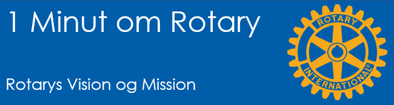

# Rotarys vision og mission

{class="shadow-longer"} 

!!! note "1 minut om Rotary er..."

    Alt om Rotary fortalt i små bidder, der kan læses op på et par minutter ved et Rotarymøde.
    
    Historierne tilstræber at komme hele vejen rundt om Rotary: vores historie, Rotary  basics, organisationen, The Rotary Foundation, Rotarys programmer, partnere og vigtige begivenheder.
    
    Serien er udarbejdet af Uddannelsesudvalget i Rotary Distrikt 1470 i 2020/21
    
    Redaktør: 
    Jens Erik Rasmussen, dg1470-1213@rotary.dk

<a href=https://1minut.rotary.dk/pdf-versioner/1_minut_om_Rotary_Vision_og_Mission.pdf target=_blank>PDF version kan downloades ved at klikke her</a>

Et grundlæggende spørgsmål som du sikkert ikke stiller dig så tit er: <strong>Hvorfor findes Rotary i det hele taget?</strong> Er det blot fordi Paul Harris fik en god idé i 1905?? Næppe. Uden en bærende idé eller et overordnet formål med vores aktiviteter, ville Rotary næppe have eksisteret mere end 100 år
Rotarys aktiviteter og mission er dikteret af vores vision for den verden vi gerne vil skabe. Visionen er et stærkt redskab når vi skal kommunikere til klubbens næste medlem hvad Rotary står for og vil lykkes med på langt sigt. Flere af de medlemmer vi får nu, har fokus på netop mening og formål, hvorfor visionen er et godt sted at påbegynde sin rejse med Rotary. 

!!! Quote "Rotarys vision"

    Sammen ser vi en verden hvor mennesker går sammen for at skabe langsigtede forandringer – på kloden, i vore lokalsamfund og i os selv

De som har været med i Rotary gennem længere tid vil kunne skrive under på, at det at påtage sig en større opgave i Rotary eller deltage aktivt i et eller flere af Rotarys projekter og programmer, skaber forandringer i den enkeltes personlighed og i andres.
Mens Rotary kun har haft en formuleret vision i få år, er Rotarys mission ældre. Den beskriver nøgternt mange af de begreber som vi møder i dagligdagen med Rotary. En slags varedeklaration på Rotary, kan man vel sige. 

!!! Quote "Rotarys mission"

    Vi tjener andre, fremmer hæderlighed, omverdensforståelse, god vilje og fred gennem vort fællesskab af lederskikkelser og specialister fra erhvervs- og samfundsliv.

Dens vigtigste elementer er
- At tjene andre som vel er det tætteste man kan komme Service på dansk og det er ledestjernen i alt hvad vi gør. Hæderlighed og fællesskab er nogle af vore kerneværdier. Forsøget på at forstå vores omverden kommer til udtryk både i Rotarys måde at inddrage det globale element i arbejdet på, lige som vore programmer for børn og voksne taler til det. God vilje og fred fremmes gennem det at foregå med det gode eksempel og modarbejde konflikter overalt.

Det er altså fejlagtigt eller i det mindste stærkt misvisende at karakterisere Rotary som blot et erhvervsnetværk.